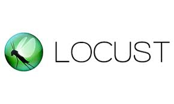
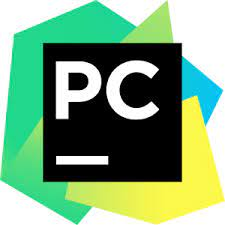

## Hi there 👋

## I am a software test engineer with over 6 years of work experience in product and service based companies. I have experience in ui automation,  backend API and mobile testing. I am a conscientious person who works hard and pays attention to detail. I'm flexible, quick to pick up new skills and eager to learn from others. I also have lots of ideas and enthusiasm. Currently testing salesforce based applications.

# AUTOMATION FRAMEWORK & DEVOPS SKILLS:
Data Driven, Key Word(Robot Framework), Hybrid, Page Object Model, Selenium WebDriver with java & python , BDD (Cucumber-JVM), TestNg, Junit, Pytest, Extent Report, Apache Log4j, SVN, GIT, GitHub, Bit bucket, Gitlab, MAVEN, Jenkins, Docker, Zalenium, TestProject, Karate Ui Testing, Playwright with java & python, Selenide, SeleniumBase with python.

      
   
   

# API (BACKEND) WEBSERVICES AUTOMATION:
SOAP, REST, Rest Assured, Postman, Newman, Swagger, Karate, Insomnia, Python Requests, Robot framework, Hoppscotch.

     
 

# DATABASE:
 Knowledge in My SQL , SQL Server. Knowledge in writing and executing SQL statements. Database testing using JDBC.
 
      

# JAVASCRIPT TOOLS:
Protractor, Taiko, Webdriver IO, Playwright.

 

# PERFORMANCE TESTING:
Knowledge in Jmeter, Karate with scala, Locust.

 

# PROJECT/TEST MANAGEMENT TOOLS:
TestLink, SquashTM, Redmine, Youtrack, Assembla, Jira, Confluence, Waterfall, Agile(Scrum).

       
 
# MOBILE TEST AUTOMATION:
Knowledge in Appium and TestProject.

  

# PROGRAMMING LANGUAGES:
Core java, php, javascript, python.

   
# IDE:
Eclipse, Visual Studio Code, PyCharm, Intellij IDEA

 
 

# Blogs:
https://medium.com/@cyrilgeorge153

https://qa-ninja-tester.blogspot.com

https://dev.to/cyrilgeorge153

